# responsi_uts_pemob

Jasmine Adzra Fakhirah
H1D022071
Responsi UTS Prak Pemob
Shift D
Pariwisata  - Tabel Penginapan

Hasil Modulo NIM : 3
3 digit terakhir : 071
Segment Satu
1.	Paket: 3
2.	Jenis Aplikasi: Aplikasi Manajemen Pariwisata
Segment Dua
1.	Digit Puluhan: 7
2.	Nama Tabel: penginapan
3.	Kolom 1: id (int, PK, increment)
4.	Kolom 2: accommodation (String)
5.	Kolom 3: room (String)
6.	Kolom 4: rate (Integer)
Segment Tiga
1.	Digit Satuan: 1
2.	Kustomisasi Tampilan UI: Tema Terang Merah, Font Arial

## Registrasi
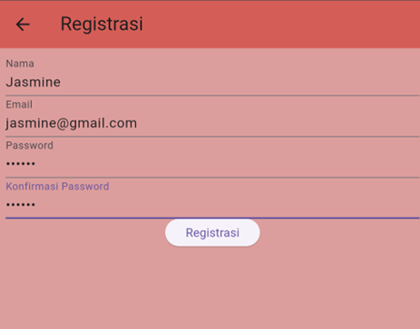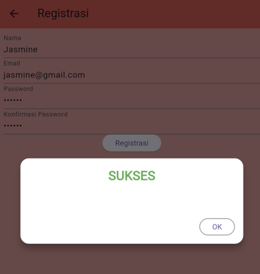
Proses registrasi dimulai dengan pengguna mengisi formulir yang berisi kolom untuk nama, email, password, dan konfirmasi password. Ketika tombol "Registrasi" diklik, formulir akan divalidasi untuk memastikan semua kolom diisi dengan benar—nama harus minimal 3 karakter, email harus valid, password harus minimal 6 karakter, dan konfirmasi password harus sama dengan password. Jika semua validasi berhasil, permintaan registrasi dikirim ke backend menggunakan fungsi RegistrasiBloc.registrasi, yang melakukan panggilan API untuk mengirimkan data. Jika responsnya berhasil, dialog sukses akan muncul yang memberi tahu pengguna bahwa registrasi berhasil dan memintanya untuk login. Jika terjadi kesalahan, dialog peringatan akan muncul, menunjukkan bahwa registrasi gagal.

## Login
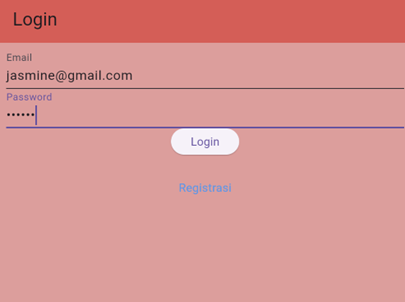
Proses login dimulai ketika pengguna mengisi email dan password di dalam form yang telah disediakan pada halaman login. Setelah pengguna menekan tombol "Login", aplikasi akan memvalidasi input, memastikan bahwa email dan password tidak kosong. Jika validasi berhasil, data yang diisi pengguna dikirim ke backend melalui fungsi LoginBloc.login, yang melakukan panggilan API untuk otentikasi.
Jika login berhasil (kode status API adalah 200), aplikasi akan menyimpan token pengguna dan ID pengguna di penyimpanan lokal menggunakan UserInfo().setToken dan UserInfo().setUserID. Selanjutnya, pengguna akan diarahkan ke halaman PenginapanPage sebagai tanda bahwa login berhasil. Jika login gagal, aplikasi akan menampilkan dialog peringatan yang memberitahukan bahwa login tidak berhasil dan meminta pengguna untuk mencoba lagi. Untuk pengguna yang belum registrasi dapat menekan tombol registrasi yang ada di bawah tombol login.

## View
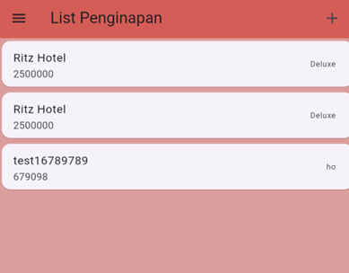
Proses view pada halaman PenginapanPage dimulai dengan menampilkan daftar penginapan menggunakan FutureBuilder yang memanggil data dari PenginapanBloc.getPenginapan. Jika data berhasil diambil, daftar penginapan ditampilkan dalam bentuk ListView. Setiap item penginapan ditampilkan menggunakan widget ItemPenginapan, yang menampilkan nama penginapan, harga (rate), dan jumlah kamar (room). Saat pengguna menekan salah satu item penginapan, mereka diarahkan ke halaman detail (PenginapanDetail) melalui navigasi Navigator.push. Selain itu, pengguna dapat menambahkan penginapan baru melalui tombol "+" di AppBar, yang akan membuka form penambahan penginapan.

## Create
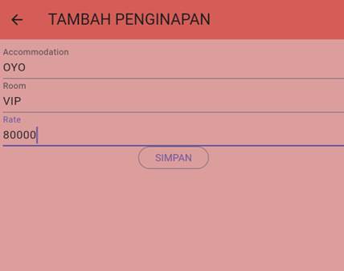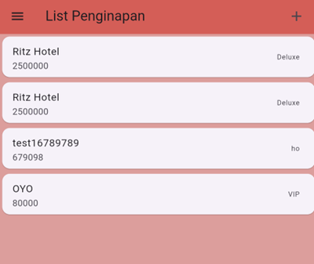
Proses create penginapan dimulai ketika pengguna menekan tombol "+" di halaman PenginapanPage, yang akan membawa mereka ke halaman PenginapanForm melalui Navigator.push. Di halaman ini, pengguna mengisi form dengan detail penginapan baru, seperti accomodation, room, dan rate. Setelah form diisi dan disubmit, data tersebut akan dikirim ke API menggunakan fungsi createPenginapan yang ada di PenginapanBloc. Jika proses berhasil, penginapan baru akan ditambahkan ke database, dan pengguna akan diarahkan kembali ke halaman daftar penginapan untuk melihat data terbaru yang telah ditambahkan.

## Detail
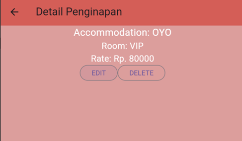
Proses detail view penginapan dimulai ketika pengguna memilih salah satu penginapan dari daftar di halaman utama. Pengguna akan diarahkan ke halaman PenginapanDetail, yang menampilkan informasi lengkap dari penginapan yang dipilih, seperti nama penginapan (accommodation), jumlah kamar (room), dan harga (rate). Di halaman ini, terdapat dua tombol: Edit dan Delete. Tombol Edit memungkinkan pengguna untuk memperbarui data penginapan, sementara tombol Delete akan meminta konfirmasi sebelum menghapus penginapan tersebut dari database melalui API. Setelah penghapusan berhasil, pengguna akan diarahkan kembali ke halaman daftar penginapan.

## Edit
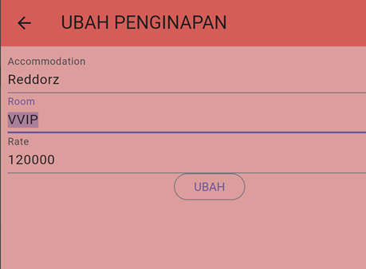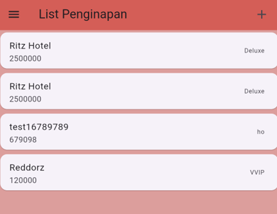
Proses edit dimulai ketika pengguna menekan tombol Edit pada halaman detail penginapan. Pengguna akan diarahkan ke halaman PenginapanForm, di mana form isian sudah terisi dengan data penginapan yang ingin diedit. Pengguna bisa mengubah informasi seperti nama penginapan (accommodation), jumlah kamar (room), atau harga (rate). Setelah perubahan dilakukan, pengguna menekan tombol Simpan untuk mengirim data yang telah diperbarui ke API menggunakan metode yang sesuai. Setelah pembaruan berhasil, pengguna akan diarahkan kembali ke halaman daftar penginapan dengan data yang telah diperbarui.

## Delete
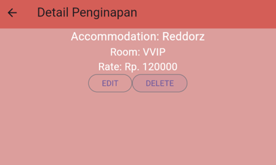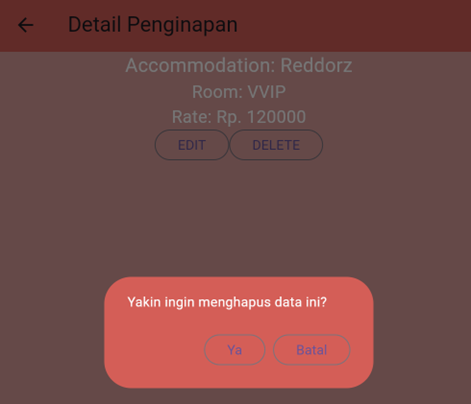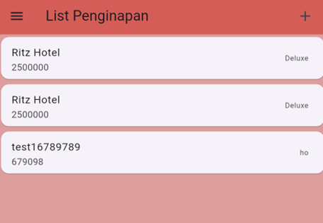
Proses delete dimulai ketika pengguna menekan tombol Delete pada halaman detail penginapan. Hal ini akan memunculkan dialog konfirmasi yang menanyakan apakah pengguna yakin ingin menghapus data tersebut. Jika pengguna memilih Ya, maka sistem akan memanggil metode untuk menghapus penginapan tersebut melalui API dengan ID penginapan yang relevan. Setelah penghapusan berhasil, pengguna akan diarahkan kembali ke halaman daftar penginapan, dan daftar tersebut akan diperbarui untuk mencerminkan bahwa penginapan yang dihapus tidak lagi ditampilkan. Jika terjadi kesalahan saat penghapusan, dialog peringatan akan muncul, memberi tahu pengguna bahwa proses penghapusan gagal.

## Logout
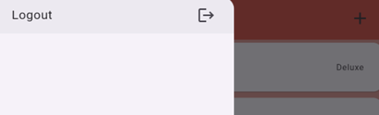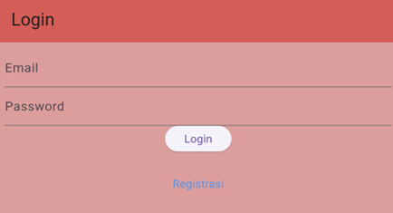
Proses logout dimulai ketika pengguna memilih opsi Logout dari sidebar di halaman penginapan. Setelah itu, sistem akan memanggil metode logout yang terdapat dalam LogoutBloc. Metode ini akan menghapus informasi pengguna yang tersimpan, seperti token otentikasi dan ID pengguna, melalui metode logout yang ada di kelas UserInfo. Setelah proses logout selesai, pengguna akan diarahkan kembali ke halaman login, sehingga mereka harus memasukkan kredensial mereka lagi untuk mengakses aplikasi. Hal ini memastikan bahwa sesi pengguna diakhiri dengan aman.